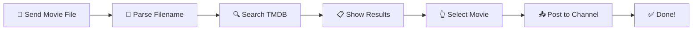

# Professional README.md for CineBrain Movie Bot

<div align="center">

# 🎬 CineBrain Movie Bot

### *Intelligent Telegram Bot for Movie Enrichment & Channel Automation*

[](https://python.org)
[](https://core.telegram.org/bots/api)
[](https://www.themoviedb.org/)
[](LICENSE)

[](https://railway.app)
[](https://render.com)


**Transform your movie files into beautifully formatted channel posts with posters, ratings, and detailed information — all automatically!**

[🚀 Quick Start](#-quick-start) •
[✨ Features](#-features) •
[📖 Documentation](#-documentation) •
[🌐 Deploy](#-deployment) •
[💬 Support](#-support)

---

</div>

## 📋 Table of Contents

<details>
<summary>Click to expand</summary>

- [Overview](#-overview)
- [Features](#-features)
- [Demo](#-demo)
- [Quick Start](#-quick-start)
- [Installation](#-installation)
- [Configuration](#-configuration)
- [Usage](#-usage)
- [Commands](#-commands)
- [Deployment](#-deployment)
- [Project Structure](#-project-structure)
- [API Reference](#-api-reference)
- [Troubleshooting](#-troubleshooting)
- [Contributing](#-contributing)
- [License](#-license)
- [Acknowledgments](#-acknowledgments)

</details>

---

## 🎯 Overview

**CineBrain Movie Bot** is a production-grade Telegram bot that automatically enriches forwarded movie files with comprehensive metadata from TMDB. It intelligently parses filenames, fetches movie information, and posts beautifully formatted content to your channel.

### Why CineBrain?

| Problem | Solution |
|---------|----------|
| 📁 Messy movie filenames | 🧠 Smart AI-powered parsing |
| 🔍 Manual movie searches | ⚡ Automatic TMDB lookup |
| 📝 No movie information | 📊 Rich metadata & posters |
| ⏰ Time-consuming posting | 🤖 One-click automation |

---

## ✨ Features

<div align="center">

| Feature | Description |
|---------|-------------|
| 🧠 **Smart Parsing** | Extracts movie titles from any filename format |
| 🎬 **TMDB Integration** | Fetches posters, ratings, genres, runtime |
| ✏️ **Title Editing** | Manually correct parsed titles |
| 📋 **Multiple Results** | Choose from up to 5 movie matches |
| 📤 **Auto Posting** | Posts to configured channel automatically |
| 🖼️ **Poster Support** | Downloads and posts movie posters |
| ⭐ **Rich Templates** | Professional formatting with ratings |
| 🔄 **Retry Logic** | Automatic retries for failed requests |
| 💾 **Smart Caching** | Caches posters for faster responses |
| 🛡️ **Error Handling** | Graceful error recovery |

</div>

### 🎭 Filename Parsing Examples

```
✅ Avengers.Endgame.2019.1080p.BluRay.x264.mkv
   → Title: "Avengers Endgame" | Year: 2019

✅ @ChannelName_Movie_2024_WEB-DL_Telugu_AAC.mkv
   → Title: "Movie" | Year: 2024

✅ The.Dark.Knight.(2008).IMAX.REMASTERED.mkv
   → Title: "The Dark Knight" | Year: 2008

✅ [Release.Group] Movie Title 720p HDRip.mp4
   → Title: "Movie Title" | Year: Auto-detected
```

---

## 🎥 Demo

<div align="center">

### Bot Interaction Flow



</div>

### Screenshots

<details>
<summary>📱 Click to view screenshots</summary>

<div align="center">

| Step 1: Send File | Step 2: Parse & Search |
|:-----------------:|:----------------------:|
|  |  |

| Step 3: Select Movie | Step 4: Posted! |
|:--------------------:|:---------------:|
|  |  |

</div>

</details>

### Channel Post Preview

```
┌─────────────────────────────────────────┐
│ 🎞️ MOVIE: Inception (2010)              │
│ ✨ Rating: ⭐⭐⭐⭐⭐ 8.8/10 (35,000 votes) │
│ ⏱ Runtime: 2h 28m                       │
│ 🎭 Genre: Action, Sci-Fi, Thriller      │
│ ━━━━━━━━━━━━━━━━━━━━━━━━━━━━━━━━━━━━━━━ │
│ 💬 Synopsis                              │
│ A thief who steals corporate secrets    │
│ through dream-sharing technology...     │
│ ━━━━━━━━━━━━━━━━━━━━━━━━━━━━━━━━━━━━━━━ │
│ 🍿 Powered by CineBrain Movie Bot 🤖    │
│                                         │
│ #Inception #2010 #Action #MustWatch     │
└─────────────────────────────────────────┘
```

---

## 🚀 Quick Start

### Prerequisites

- Python 3.10 or higher
- Telegram Bot Token ([Get from @BotFather](https://t.me/BotFather))
- TMDB API Key ([Get from TMDB](https://www.themoviedb.org/settings/api))
- Telegram Channel (with bot as admin)

### 30-Second Setup

```bash
# Clone the repository
git clone https://github.com/yourusername/cinebrain-movie-bot.git
cd cinebrain-movie-bot

# Create virtual environment
python -m venv venv

# Activate virtual environment
# Windows:
venv\Scripts\activate
# Linux/Mac:
source venv/bin/activate

# Install dependencies
pip install -r requirements.txt

# Configure environment
cp .env.example .env
# Edit .env with your credentials

# Run the bot
python run.py
```

---

## 📦 Installation

### Method 1: Standard Installation

<details>
<summary>Click to expand</summary>

#### Step 1: Clone Repository

```bash
git clone https://github.com/yourusername/cinebrain-movie-bot.git
cd cinebrain-movie-bot
```

#### Step 2: Create Virtual Environment

```bash
# Windows
python -m venv venv
venv\Scripts\activate

# Linux/macOS
python3 -m venv venv
source venv/bin/activate
```

#### Step 3: Install Dependencies

```bash
pip install --upgrade pip
pip install -r requirements.txt
```

#### Step 4: Configure Environment

```bash
cp .env.example .env
```

Edit `.env` with your favorite editor:

```env
TELEGRAM_BOT_TOKEN=your_bot_token_here
TELEGRAM_CHANNEL_ID=-1001234567890
TMDB_API_KEY=your_tmdb_api_key_here
LOG_LEVEL=INFO
```

#### Step 5: Run the Bot

```bash
python run.py
```

</details>

### Method 2: Docker Installation

<details>
<summary>Click to expand</summary>

```bash
# Clone repository
git clone https://github.com/yourusername/cinebrain-movie-bot.git
cd cinebrain-movie-bot

# Create .env file
cp .env.example .env
# Edit .env with your credentials

# Build and run with Docker Compose
docker-compose up -d

# View logs
docker-compose logs -f

# Stop the bot
docker-compose down
```

</details>

---

## ⚙️ Configuration

### Environment Variables

Create a `.env` file in the project root:

```env
# ═══════════════════════════════════════════════════════════
# 🎬 CINEBRAIN MOVIE BOT CONFIGURATION
# ═══════════════════════════════════════════════════════════

# ─────────────────────────────────────────────────────────────
# TELEGRAM SETTINGS
# ─────────────────────────────────────────────────────────────

# Bot token from @BotFather
TELEGRAM_BOT_TOKEN=123456789:ABCdefGHIjklMNOpqrsTUVwxyz

# Channel ID (must start with -100)
TELEGRAM_CHANNEL_ID=-1001234567890

# ─────────────────────────────────────────────────────────────
# TMDB SETTINGS
# ─────────────────────────────────────────────────────────────

# API key from themoviedb.org
TMDB_API_KEY=your_32_character_api_key_here

# API URLs (usually don't change)
TMDB_BASE_URL=https://api.themoviedb.org/3
TMDB_IMAGE_BASE_URL=https://image.tmdb.org/t/p

# ─────────────────────────────────────────────────────────────
# BOT SETTINGS
# ─────────────────────────────────────────────────────────────

# Logging level: DEBUG, INFO, WARNING, ERROR
LOG_LEVEL=INFO

# Cache settings
POSTER_CACHE_TTL=3600
POSTER_CACHE_MAX_SIZE=100

# Request settings
REQUEST_TIMEOUT=30
MAX_RETRIES=3

# ─────────────────────────────────────────────────────────────
# ACCESS CONTROL (Optional)
# ─────────────────────────────────────────────────────────────

# Comma-separated user IDs (leave empty for all users)
ALLOWED_USER_IDS=
```

### Getting Your Credentials

<details>
<summary>🤖 How to get Telegram Bot Token</summary>

1. Open Telegram and search for `@BotFather`
2. Send `/newbot`
3. Follow the prompts to create your bot
4. Copy the token provided

</details>

<details>
<summary>📺 How to get Channel ID</summary>

**Method 1: Using @userinfobot**
1. Forward any message from your channel to `@userinfobot`
2. It will reply with the channel ID

**Method 2: Using Web Telegram**
1. Open [web.telegram.org](https://web.telegram.org)
2. Navigate to your channel
3. Look at the URL: `web.telegram.org/z/#-1001234567890`
4. The number after `#` is your channel ID

</details>

<details>
<summary>🎬 How to get TMDB API Key</summary>

1. Go to [themoviedb.org](https://www.themoviedb.org/)
2. Create an account and verify email
3. Go to Settings → API
4. Request an API key (choose "Developer")
5. Copy the "API Key (v3 auth)"

</details>

---

## 📖 Usage

### Basic Workflow

```
1️⃣  Forward a movie file to the bot
         ↓
2️⃣  Bot parses filename and shows detected title
         ↓
3️⃣  Click "Search" or "Edit Title"
         ↓
4️⃣  Select the correct movie from results
         ↓
5️⃣  Movie is posted to channel with poster!
```

### Interactive Buttons

| Button | Action |
|--------|--------|
| ✅ **Search** | Search TMDB with detected title |
| ✏️ **Edit Title** | Manually enter correct title |
| ❌ **Cancel** | Cancel the operation |
| 🎬 **Movie Options** | Select from search results |
| ❌ **None of these** | Enter title manually |

---

## 🎮 Commands

| Command | Description |
|---------|-------------|
| `/start` | Welcome message and instructions |
| `/help` | Detailed help and usage guide |
| `/status` | Check bot and API status |
| `/parse <filename>` | Test filename parser |
| `/about` | About the bot |
| `/stats` | View bot statistics (admin) |
| `/cancel` | Cancel current operation |

### Command Examples

```
/parse Avengers.Endgame.2019.1080p.BluRay.mkv
→ 🎬 Title: Avengers Endgame
→ 📅 Year: 2019

/status
→ ✅ Bot Status: Online
→ 🎬 TMDB: Connected
→ 🚀 Ready to process movies!
```

---

## 🌐 Deployment

### Free Deployment Options

<div align="center">

| Platform | Cost | Setup Time | Reliability |
|----------|------|------------|-------------|
| [](https://railway.app) | Free $5/mo | 5 mins | ⭐⭐⭐⭐ |
| [](https://render.com) | Free | 5 mins | ⭐⭐⭐⭐ |
| [](https://fly.io) | Free | 10 mins | ⭐⭐⭐⭐ |
| [](https://cloud.oracle.com) | Free Forever | 30 mins | ⭐⭐⭐⭐⭐ |

</div>

### Deploy to Railway (Recommended)

[](https://railway.app/template/your-template)

<details>
<summary>📝 Manual Railway Setup</summary>

1. Fork this repository
2. Go to [railway.app](https://railway.app)
3. Click "New Project" → "Deploy from GitHub"
4. Select your forked repository
5. Add environment variables
6. Deploy!

</details>

### Deploy to Render

[](https://render.com/deploy)

<details>
<summary>📝 Manual Render Setup</summary>

1. Fork this repository
2. Go to [render.com](https://render.com)
3. Click "New +" → "Background Worker"
4. Connect your repository
5. Add environment variables
6. Deploy!

</details>

### Deploy to VPS (Oracle Cloud Free)

<details>
<summary>📝 VPS Deployment Guide</summary>

```bash
# SSH into your VPS
ssh ubuntu@your-vps-ip

# Clone repository
git clone https://github.com/yourusername/cinebrain-movie-bot.git
cd cinebrain-movie-bot

# Run setup script
chmod +x deploy.sh
./deploy.sh

# Edit configuration
nano .env

# Start the bot
sudo systemctl start moviebot

# Check status
sudo systemctl status moviebot
```

</details>

---

## 📁 Project Structure

```
cinebrain-movie-bot/
│
├── 📄 run.py                 # Entry point
├── 📄 requirements.txt       # Dependencies
├── 📄 .env.example          # Environment template
├── 📄 Dockerfile            # Docker configuration
├── 📄 docker-compose.yml    # Docker Compose config
├── 📄 Procfile              # Process file for deployment
├── 📄 railway.json          # Railway configuration
├── 📄 render.yaml           # Render configuration
│
├── 📁 src/
│   ├── 📄 __init__.py
│   ├── 📄 bot.py            # Main bot module
│   ├── 📄 config.py         # Configuration management
│   ├── 📄 tmdb_service.py   # TMDB API client
│   │
│   ├── 📁 handlers/
│   │   ├── 📄 __init__.py
│   │   └── 📄 movie_handler.py  # Movie processing
│   │
│   └── 📁 utils/
│       ├── 📄 __init__.py
│       ├── 📄 parser.py     # Filename parser
│       └── 📄 cache.py      # Caching utilities
│
├── 📁 systemd/
│   └── 📄 movie-bot.service # Systemd service file
│
└── 📁 assets/
    ├── 📄 banner.png
    └── 📄 screenshots/
```

---

## 🔧 API Reference

### MovieInfo Object

```python
@dataclass
class MovieInfo:
    id: int                      # TMDB movie ID
    title: str                   # Movie title
    year: Optional[int]          # Release year
    rating: float                # Rating (0-10)
    overview: str                # Synopsis
    poster_url: Optional[str]    # Poster image URL
    runtime: Optional[int]       # Runtime in minutes
    genres: List[str]            # List of genres
    tagline: Optional[str]       # Movie tagline
    vote_count: int              # Number of votes
```

### FilenameParser

```python
from src.utils.parser import parse_filename

result = parse_filename("Movie.Name.2024.1080p.WEB-DL.mkv")
print(result.title)  # "Movie Name"
print(result.year)   # 2024
```

---

## 🔍 Troubleshooting

<details>
<summary>❌ Bot not responding</summary>

1. Check if bot is running: `sudo systemctl status moviebot`
2. View logs: `sudo journalctl -u moviebot -f`
3. Verify bot token is correct
4. Ensure bot is not blocked

</details>

<details>
<summary>❌ TMDB search not working</summary>

1. Verify TMDB API key is correct
2. Check API rate limits
3. Ensure internet connectivity
4. View logs for error details

</details>

<details>
<summary>❌ Cannot post to channel</summary>

1. Verify channel ID is correct (must start with `-100`)
2. Ensure bot is admin in channel
3. Check bot has "Post Messages" permission
4. Try removing and re-adding bot to channel

</details>

<details>
<summary>❌ Filename not parsed correctly</summary>

1. Use `/parse <filename>` to test
2. Use "Edit Title" button to correct
3. Include year in search for better results
4. Report issues on GitHub

</details>

---

## 🤝 Contributing

Contributions are welcome! Here's how you can help:

### Development Setup

```bash
# Fork and clone
git clone https://github.com/yourusername/cinebrain-movie-bot.git
cd cinebrain-movie-bot

# Create branch
git checkout -b feature/your-feature

# Make changes and test
python run.py

# Commit and push
git add .
git commit -m "Add: your feature description"
git push origin feature/your-feature

# Open Pull Request
```

### Contribution Guidelines

- 📝 Follow PEP 8 style guide
- ✅ Add tests for new features
- 📖 Update documentation
- 🔍 Test thoroughly before submitting

---

## 📜 License

This project is licensed under the MIT License - see the [LICENSE](LICENSE) file for details.

```
MIT License

Copyright (c) 2024 CineBrain

Permission is hereby granted, free of charge, to any person obtaining a copy
of this software and associated documentation files (the "Software"), to deal
in the Software without restriction, including without limitation the rights
to use, copy, modify, merge, publish, distribute, sublicense, and/or sell
copies of the Software, and to permit persons to whom the Software is
furnished to do so, subject to the following conditions:

The above copyright notice and this permission notice shall be included in all
copies or substantial portions of the Software.
```

---

## 🙏 Acknowledgments

<div align="center">

| | |
|:-:|:-:|
| [](https://www.themoviedb.org/) | Movie data provided by TMDB |
| [](https://telegram.org/) | Telegram Bot Platform |
| [](https://python.org/) | python-telegram-bot library |

</div>

---

## 💬 Support

<div align="center">

| Channel | Link |
|---------|------|
| 📧 **Email** | support@cinebrain.com |
| 💬 **Telegram** | [@CineBrainSupport](https://t.me/CineBrainSupport) |
| 🐛 **Issues** | [GitHub Issues](https://github.com/yourusername/cinebrain-movie-bot/issues) |
| 💡 **Discussions** | [GitHub Discussions](https://github.com/yourusername/cinebrain-movie-bot/discussions) |

</div>

---

<div align="center">

### ⭐ Star this repository if you found it helpful!

<br>

[](https://github.com/yourusername/cinebrain-movie-bot/stargazers)
[](https://github.com/yourusername/cinebrain-movie-bot/network/members)
[](https://github.com/yourusername/cinebrain-movie-bot/watchers)

<br>

**Made with ❤️ by [CineBrain](https://cinebrain.vercel.app/)**


</div>
```

---

## 📁 Also Create These Asset Files

### 1. Create `assets/` folder with placeholder images

Create a folder called `assets` and add these placeholder files (you can replace with actual images later):

### 2. LICENSE file

```
MIT License

Copyright (c) 2024 CineBrain

Permission is hereby granted, free of charge, to any person obtaining a copy
of this software and associated documentation files (the "Software"), to deal
in the Software without restriction, including without limitation the rights
to use, copy, modify, merge, publish, distribute, sublicense, and/or sell
copies of the Software, and to permit persons to whom the Software is
furnished to do so, subject to the following conditions:

The above copyright notice and this permission notice shall be included in all
copies or substantial portions of the Software.

THE SOFTWARE IS PROVIDED "AS IS", WITHOUT WARRANTY OF ANY KIND, EXPRESS OR
IMPLIED, INCLUDING BUT NOT LIMITED TO THE WARRANTIES OF MERCHANTABILITY,
FITNESS FOR A PARTICULAR PURPOSE AND NONINFRINGEMENT. IN NO EVENT SHALL THE
AUTHORS OR COPYRIGHT HOLDERS BE LIABLE FOR ANY CLAIM, DAMAGES OR OTHER
LIABILITY, WHETHER IN AN ACTION OF CONTRACT, TORT OR OTHERWISE, ARISING FROM,
OUT OF OR IN CONNECTION WITH THE SOFTWARE OR THE USE OR OTHER DEALINGS IN THE
SOFTWARE.
```

### 3. CONTRIBUTING.md

```markdown
# Contributing to CineBrain Movie Bot

Thank you for your interest in contributing! 🎉

## How to Contribute

1. Fork the repository
2. Create a feature branch (`git checkout -b feature/amazing-feature`)
3. Commit your changes (`git commit -m 'Add amazing feature'`)
4. Push to the branch (`git push origin feature/amazing-feature`)
5. Open a Pull Request

## Development Guidelines

- Follow PEP 8 style guide
- Add docstrings to all functions
- Write meaningful commit messages
- Test your changes thoroughly

## Reporting Bugs

Use GitHub Issues with:
- Clear description
- Steps to reproduce
- Expected vs actual behavior
- Screenshots if applicable

## Feature Requests

We love new ideas! Open an issue with:
- Clear description of the feature
- Use case explanation
- Any implementation suggestions

Thank you for contributing! 🙏